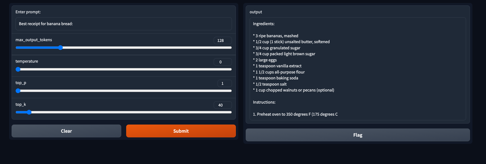
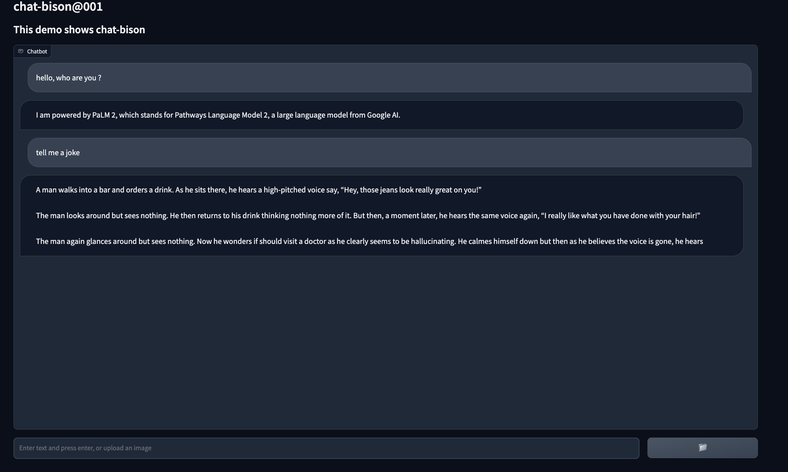
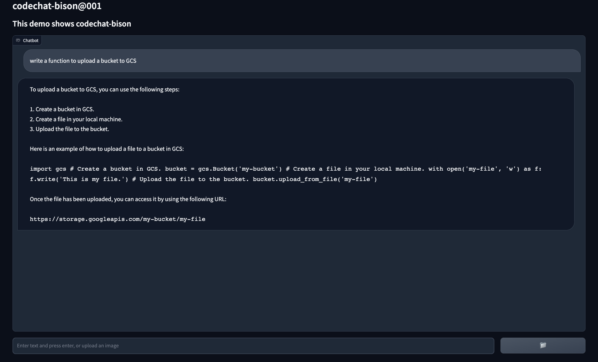

# Transformers and NLP labs

## 01 Embeddings, tokenization

* Lab 01-1: [Intro tokenizers](01-embeddings-tokenizers/01-1-intro-tokenizers.ipynb)
* Lab 01-2: [Tokenizer comparison](01-embeddings-tokenizers/01-2-tokenizers-comparison.ipynb): embeddings and tokenizers like [tiktoken](https://github.com/openai/tiktoken) which is a fast BPE tokeniser for use with OpenAI's models; or [Wordpiece](https://keras.io/api/keras_nlp/tokenizers/word_piece_tokenizer/) which is the tokenizer used to train BERT. 
* Lab 01-3: [Load text with TensorFlow: preprocessing](01-embeddings-tokenizers/01-3-loadtext.ipynb)
* Lab 01-4: [Embeddings layers](01-embeddings-tokenizers/01-4-embeddings.ipynb)
* Lab 01-5: [ScaNN](01-embeddings-tokenizers/01-5-scann.ipynb)
* Lab 01-6: [Word2Vec](01-embeddings-tokenizers/01-6-word2vec-get-dataset.ipynb)


## 02 Recurrent Neural Networks

* Lab 02-1: [Activation functions](02-rnn-lstm/02-1-activation-functions.ipynb)
* Lab 02-2: [RNN vanilla and LSTM cells in Keras](02-rnn-lstm/02-2-rnn-vanilla.ipynb)
* Lab 02-3: [Load Text with TensorFlow: training](02-rnn-lstm/02-3-loadtext-full.ipynb)
* Lab 02-4: [Dataset hubs](02-rnn-lstm/02-4-datasets.ipynb)


## 03 Attention mechanisms

* Lab 03-1: [Load Text with TensorFlow: Conv1D layers](03-attention-transformers/03-1-loadtext-full-conv1d.ipynb)
* Lab 03-2: [Self attention](03-attention-transformers/03-2-self-attention.ipynb)
* Lab 03-3: [Absolute Positional Encoding](03-attention-transformers/03-3-positional-encodings-ape.ipynb)
* Lab 03-4: [Keras NLP](03-attention-transformers/03-4-keras-nlp.ipynb)
* Lab 03-5: [Tiny transformers with Keras NLP](03-attention-transformers/03-5-tiny-transformer-keras-nlp.ipynb)
* Lab 03-6: [Hugging Face SDK introduction](03-attention-transformers/03-6-huggingface.ipynb)


## 04 First-generation LLM models (Pre-Chinchilla). Pre-training

* Lab 04-1: [Model hubs](04-pretraining-bert/04-1-modelhub.ipynb)
* Lab 04-2: [BERT pre-training with Keras NLP](04-pretraining-bert/04-2-pretraining-bert-keras-nlp.ipynb) 
* Lab 04-3: [BERT pre-training with Keras NLP and `keras_nlp.models.BertBackbone` class](04-pretraining-bert/04-3-pretraining-bert-keras-backbone.ipynb)
* Lab 04-4: [BERT pre-training with Hugging Face transformers](04-pretraining-bert/04-4-pretraining-bert-hf.ipynb)
* Lab 04-5: [Fine-tuning T5-small model in Hugging Face with BillSum](04-pretraining-bert/04-5-summarization-t5-billsum.ipynb)
* Lab 04-6: [Inference and finetuning with FinBERT](04-pretraining-bert/04-6-classification-finbert.ipynb)
* Lab 04-7: [Inference with RoBERTalex](04-pretraining-bert/04-7-classification-robertalex.ipynb)
* Lab 04-8: [Translation from Spanish to German using `transformers.pipeline`](04-pretraining-bert/04-8-translate-es-de.ipynb)

Frameworks for pre-training:

* **Merlin:** NVIDIA Merlin is an open-source framework for building large-scale deep learning recommender system. Integration with Vertex AI is detailed [here](https://github.com/GoogleCloudPlatform/nvidia-merlin-on-vertex-ai).
* **T5X:** framework to build and train LLMs at scale, allowing to use Vertex AI and Cloud TPUs.
The following tasks are supported: train, fine-tune, evaluate and inference (with Vertex AI)
* **Pax**: Pending

**Dockerfile for T5**: Rebuild docker image every time you make any modifications on custom tasks, under `tasks/` directory. Dockerfile builds a docker with T5X, JAX with TPU support, [flaxformer](https://github.com/google/flaxformer) (a transformer library for NLP and multimodal research) and local `tasks/` directory:

```sh
export PROJECT_ID=<YOUR_PROJECT_ID>
gcloud config set project $PROJECT_ID
 
IMAGE_NAME=t5x-base
IMAGE_URI=gcr.io/${PROJECT_ID}/${IMAGE_NAME}
gcloud builds submit --timeout "2h" --tag ${IMAGE_URI} . --machine-type=e2-highcpu-8
```

The T5X GitHub repo includes [references](https://github.com/google-research/t5x/blob/main/docs/models.md) to a large number of pretrained Transformer models, including the T5 and Switch Transformer families of models.


## 05 Second-generation LLM models (Post-Chinchilla). Evaluation.

* Lab 05-1: text-bison-gradio: `text-bison@001` lab in Gradio. Refer to this [Medium post](https://medium.com/google-cloud/generative-ai-palm-2-model-deployment-with-cloud-run-54e8a398b24b) for deployment of text generation models in Cloud Run.



* Lab 05-2: chat-bison-gradio: `chat-bison@001` lab in Gradio.



* Lab 05-3: codechat-bison-gradio: `codechat-bison@001` lab in Gradio. Demo script (for Gradio or Generative AI Studio): 1. _"Generate Python code for a TensorFlow model to do classification using the MNIST dataset"_ 2. _"Explain Adam optimizer and also suggest other optimizers"_



* Lab 05-5: [LLM evaluation (classification)](05-llm/05-5-eval-classification.ipynb)
* Lab 05-6: [LLM evaluation (summarization)](05-llm/05-6-eval-summarization.ipynb)
* Lab 05-7: [LLM evaluation (text generation)](05-llm/05-7-eval-textgeneration.ipynb)
* Lab 05-8: [LLM evaluation (Q&A)](05-llm/05-8-eval-qna.ipynb)

### GPT-3

In comparison to GPT-3 (175B parameters), Jurassic-1 (178B parameters), Gopher (280B parameters), and Megatron-Turing NLG (530B parameters), Chinchilla AI's main selling point is that it can be created for the same anticipated cost as Gopher, and yet it employs fewer parameters with more data to provide, on average, 7% more accurate results than Gopher.

### Chinchilla

Chinchilla outperforms Gopher (280B), GPT-3 (175B), Jurassic-1 (178B), and Megatron-Turing NLG (530B) on a wide array of downstream evaluation tasks. It considerably simplifies downstream utilization because it requires much less computer power for inference and fine-tuning. The article also explains that based on the training of previously employed language models, it has been determined that if one doubles the model size, one must also have twice the number of training tokens. This hypothesis has been used to train Chinchilla AI by DeepMind. Similar to Gopher in terms of cost, Chinchilla AI has 70B parameters and four times as much data.

Chinchilla has an average accuracy of 67.5% on the MMLU benchmark, which is 7% higher than Gopher’s performance. Unfortunately, the general public cannot currently use Chinchilla AI, because it is still in the testing phase as of January 12, 2023. Once released, Chinchilla AI will be useful for developing various artificial intelligence tools, such as chatbots, virtual assistants, and predictive models.

### Sparrow

[Sparrow](https://www.deepmind.com/blog/building-safer-dialogue-agents) by Deep Mind. Sparrow uses training and RLHF based tuning

[Google trends](https://trends.google.com/trends/explore?date=today%203-m&q=OpenAI,chatGPT,lamda,sparrow)

### Jurassic-X

Jurassic-X from AI21, based on MRKL (Miracle): https://arxiv.org/pdf/2205.00445.pdf and https://www.ai21.com/blog/jurassic-x-crossing-the-neuro-symbolic-chasm-with-the-mrkl-system


## Duet AI

Demo script with **Duet AI for Developers** in VS code:
```sh
# Demo in VS Code
1. write a fibonacci number (ALT+SPACE to generate)
2. write a funtion toc reate a bucket, with assert
3. write a function to upload a file
4. borrar una frase y ver cómo me la rellena de neuvo
5. chat: explain my code now propose a tes plan,, docusing on unit tests,  but write the response in spanish

# Demo in Cloud Shell
1. what is the gcloud command to create a vertex workbench instance with python3.7 ?
```


## Use Cases with transformers

### Classification

* **classification-bart-infer-vertex**

* **classification-bert-imdb-finetuning-tf-vertex**: using Hugging Face with TensorFlow, this lab **fine tunes a BERT model** on the IMDB dataset, using Vertex AI. The model will predict whether a movie review are positive or negative. The dataset will be downloaded from the [Hugging Face datasets library](https://huggingface.co/docs/datasets/index), and the BERT model from the [Hugging Face transformers library](https://huggingface.co/docs/transformers/index).The model is trained on Vertex AI. This sample code is taken from [this codelab](https://codelabs.developers.google.com/vertex-training-autopkg#1)

* **classification-bert-imdb-finetuning-pt-vertex**: using Hugging Face with PyTorch, this lab **fine tunes a BERT model** on the IMDB dataset, using Vertex AI. The model will predict whether a movie review are positive or negative. The dataset will be downloaded from the [Hugging Face datasets library](https://huggingface.co/docs/datasets/index), and the BERT model from Hugging Face `bert-base-cased`. The model is trained on Vertex AI. This sample code is taken from [this notebook](https://github.com/GoogleCloudPlatform/vertex-ai-samples/blob/main/community-content/pytorch_text_classification_using_vertex_sdk_and_gcloud/pytorch-text-classification-vertex-ai-train-tune-deploy.ipynb)

* **Deberta model (text classification):** this lab has **no code attached**. Fine-tune the model using the instructions given in [microsoft/deberta-v3-large](https://huggingface.co/microsoft/deberta-v3-large#fine-tuning-with-hf-transformers):

```bash
cd transformers/examples/pytorch/text-classification
pip install -q -r requirements.txt
mkdir output
```

```sh
python run_glue.py \
  --model_name_or_path microsoft/deberta-v3-large \
  --dataset_name imdb \
  --do_train \
  --do_eval \
  --evaluation_strategy steps \
  --max_seq_length 256 \
  --warmup_steps 50 \
  --learning_rate 6e-6 \
  --num_train_epochs 2 \
  --output_dir output \
  --overwrite_output_dir \
  --logging_steps 1000 \
  --logging_dir output/
```

### Summarization

[Transformers Spanish Summarizer](https://forums.fast.ai/t/transformers-spanish-summarizer/81537)

Datasets:
* [XSUM](https://github.com/EdinburghNLP/XSum): extreme summrization. Even if available in tfds, you must manually download it from [here](https://github.com/EdinburghNLP/XSum/blob/master/XSum-Dataset/README.md#running-the-download-and-extraction-scripts).
* [MLSUM](https://arxiv.org/abs/2004.14900): MLSum is a multilingual summarization dataset crawled from different news websites. The GEM version supports the German and Spanish subset alongside specifically collected challenge sets for COVID-related articles to test out-of-domain generalization.
* [XL-Sum](https://arxiv.org/abs/2106.13822): Large-Scale Multilingual Abstractive Summarization for 44 Languages. Downloads of XLSUM in different languages is available [here](https://huggingface.co/datasets/csebuetnlp/xlsum/tree/main/data). The data stems from BBC news articles.

An **extractive summarization** method is concatenating important sentences or paragraphs without understanding the meaning of those sentences. 

An **abstractive summarization** method is generating the meaningful summary.

* **summarization-bart-hf-colab**: summarization lab with BART using Hugging Face. Fine-tuning [summarization model](https://github.com/huggingface/transformers/tree/main/examples/tensorflow/summarization). 
```sh
python run_summarization.py  \
--model_name_or_path facebook/bart-base \
--dataset_name cnn_dailymail \
--dataset_config "3.0.0" \
--output_dir /tmp/tst-summarization  \
--per_device_train_batch_size 8 \
--per_device_eval_batch_size 16 \
--num_train_epochs 3 \
--do_train \
--do_eval
```

* **summarization-mt5-xlsum-spanish-colab**: Summarization of Spanish news with mT5. Using libraries from Hugging Face, this lab finetunes a mT5-small model using the csebuetnlp/xlsum Spanish dataset. Based on [this article](https://tsmatz.wordpress.com/2022/11/25/huggingface-japanese-summarization/) for Japanese summarization. Results after 10 epochs (more than 6 hours with 1xV100 GPU) are the following:

```sh
{'eval_loss': 2.5521950721740723, 'eval_rouge1': 0.32208102802577127, 'eval_rouge2': 0.15248302577308254, 'eval_rougeL': 0.27589670422798657, 'eval_rougeLsum': 0.27411678873531675, 'eval_runtime': 14.3545, 'eval_samples_per_second': 1.393, 'eval_steps_per_second': 1.393, 'epoch': 10.0}                                                                                                          
{'train_runtime': 21021.3976, 'train_samples_per_second': 18.129, 'train_steps_per_second': 0.566, 'train_loss': 2.6270377575850286, 'epoch': 10.0}                                                     
100%|███████████████████████████████████████████████████████████████████████████████████████████████████████████████████████████████████████████████████████████| 11900/11900 [5:50:21<00:00,  1.77s/it]
***** Input's Text *****
Los algoritmos son como manos invisibles que toman decisiones por nosotros. 
El diccionario de la Real Academia Española lo define como "un conjunto ordenado y finito de operaciones que permite hallar la solución de un problema". 
Pero en la sociedad contemporánea, los algoritmos han adquirido un rol cada vez más central, 
haciendo que algunos los definan como una suerte de mano invisible que toma decisiones por nosotros. 
"Todo lo que la gente hace y ve en la web es producto de algoritmos", explican en un informe expertos del centro independiente de investigación Pew Research Center, 
con sede en Washington, Estados Unidos. En otras palabras, son el mecanismo oculto responsable de lo que vemos en el muro Facebook, 
las sugerencias que nos muestra Netflix o los resultados que aparecen cuando introducimos una palabra en el buscador de Google. 
Final de Quizás también te interese Los algoritmos están detrás de mucho de lo que vemos, o no, en la red. 
Y, a veces, pueden incluso ser los responsables de que seamos seleccionados o rechazados para un trabajo, 
recibamos un préstamo o incluso se caiga la bolsa de Wall Street. 
Falta de transparencia Por todas esas razones cada vez preocupa más que los algoritmos usados por los gigantes tecnológicos no sean siempre justos en las decisiones que toman.
 Y los errores en los sistemas de reconocimiento facial son un ejemplo de ello. Pero además, a menudo los algoritmos operan dentro de lo que se conoce como "cajas negras", 
 lo que significa que ni siquiera sus dueños pueden ver cómo están tomando esas decisiones. Los algoritmos están involucrados en cada vez más dimensiones de nuestras vidas. 
 Por eso algunas compañías tecnológicas, como IBM, están buscando soluciones a ese problema. 
El gigante estadounidense acaba de presentar un nuevo servicio de software que "detecta automáticamente los sesgos (de los algoritmos) y proporciona la explicación 
sobre las decisiones que toma la inteligencia artificial", se lee en un comunicado publicado este miércoles. 
La idea es que con el Fairness 360 Kit sus clientes puedan observar en tiempo real -a través de un panel visual- cómo los algoritmos toman decisiones y 
qué factores usan para hacer recomendaciones al final del proceso. "Estamos facilitando a las empresas que utilizan la inteligencia artificial una mayor transparencia y 
control paraafrontar el riesgo potencial de una toma de decisiones errónea", explicó Beth Smith, directora general de Watson AI, el sistema de inteligencia artificial de IBM.
 Algorithms and machine-learning could increasingly be used to calculate things like car insurance Microsoft es otra de las compañías que está trabajando en el tema. 
 La multinacional anunció en mayo, durante su conferencia anual de desarrolladores, que está trabajando en una herramienta para detectar sesgos en sus algoritmos. 
 "Por supuesto, no podemos esperar la perfección, siempre habrá algún sesgo no detectado o que no se puede eliminar, el objetivo es hacer todo lo que podamos", 
 dijo Rich Caruna, un investigador senior de la compañía. Facebook, perjudicada tras el escándalo de Cambridge Analytica en abril, 
 también declaró que está probando una herramienta para determinar si su algoritmo genera errores. 
 Y lo mismo se aplica a Google, que la semana pasada lanzó un sistema para explicar a sus usuarios cómo funcionan sus modelos de aprendizaje automático. 
 Pero, ¿cómo llegamos a este punto? Un problema de diversidad La dependencia en aprendizaje automático y los algoritmos ha hecho que el problema de los sesgos sea cada vez más importante para la comunidad vinculada a iniciativas de Inteligencia Artificial. "Y parte del problema es que las bases de datos empleadas para 'entrenar' a los algoritmos no siempre es lo suficientemente diversa", explica la reportera de tecnología de la BBC Zoe Kleinman. Joy Buolamwini, fundadora de la Liga de la Justicia Algorítmica, dice que su computadora reconoció una máscara blanca, pero no su cara. Joy Buolamwini, por ejemplo, fundó la Liga de la Justicia Algorítmica mientras cursaba estudios de postgrado en el MIT en 2016, luego de descubrir que un sistema de reconocimiento facial solo notaba su rostro si lo cubría con una máscara blanca. Y un año antes Google tuvo que disculparse cuando su algoritmo de clasificación de fotos confundió imágenes de personas negras con gorilas. Por eso hay un debate creciente sobre la ética de la inteligencia artificial, dice Kay Firth-Butterfield, quien encabeza el programa de inteligencia artificial y aprendizaje automático en el Foro Económico Mundial,. "Como abogada, algunas de las preguntas sobre cómo averiguamos qué hizo que un algoritmo funcionara mal me parecen muy interesantes", declaró Firth-Butterfield en una entrevista reciente con el canal de televisión estadounidense CNBC. "Cuando hablamos sobre sesgos, nos preocupa sobre todo la visión de quienes crearon los algoritmos, y son sobre todo hombres jóvenes y blancos, por eso necesitamos hacer que la industria sea mucho más diversa en Occidente", añadió. Necesidad de protección Esos sesgos también pueden afectar a decisiones como el seguro médico, la escolaridad o el registro criminal, a medida que las decisiones gubernamentales se vuelven más automatizadas. Y por eso AI Now -un instituto de investigación que estudia las implicaciones sociales de la inteligencia artificial- sostiene en un reporte reciente que es vital que las agencias gubernamentales dejen de usar algoritmos "de caja negra". Cada vez más activistas exigen poder conocer como toman decisiones esos algoritmos que nos afectan. "Los ciudadanos deberían saber cómo se toman las decisiones", dijo Kate Crawford, exinvestigadora en Microsoft y fundadora de AI Now. "Son sistemas complejos, y se espera que sean todavía más complejos a medida que las tecnologías de aprendizaje automático se hacen más accesibles para las empresas", reconoció. Pero es precisamente por eso que "deberíamos tener procesos de protección equivalentes para decisiones algorítmicas que para decisiones humanas", sostiene la fundadora de AI Now. Ahora puedes recibir notificaciones de BBC News Mundo. Descarga la nueva versión de nuestra app y actívala para no perderte nuestro mejor contenido.
***** Summary Text (True Value) *****
¿Qué es un algoritmo? Es una palabra de moda, pero a muchos todavía nos cuesta comprender su significado.
***** Summary Text (Generated Text) *****
"Los algoritmos son invisibles que toman decisiones por nosotros".        
```

mT5 checkpoints are available here:
```sh
gsutil cp -r mt5-summarize-spanish  gs://checkpoints-mt5 # upload
```

Pretrained mT5 model is availalble at `gs://model-summarization-mt5-spanish`.


### Translation

* **translation-bert-tr-en-colab**: minimal code sample that performs **inference** using Hugging Face for Turkish to English translations based on **Helsinki-NLP models and datasets** from the Language Technology Research Group at the University of Helsinki.

* **translation-bert-tr-en-finetuning-vertex**: fine tuning BERT for tr-en translation with Hugging Face on Vertex AI Training. Using libraries from Hugging Face, this lab **fine tunes a BERT model** for tr-en translation, using the Helsinki-NLP model checkpoints (for turkish-english) and the WMT dataset for finetuning. Based on this [blog post](https://medium.com/@tskumar1320/how-to-fine-tune-pre-trained-language-translation-model-3e8a6aace9f).

* **translation-tr-en-mt5-finetuning**: mT5 is a multilingual variant of T5 that was pre-trained on a new Common Crawl-based dataset covering 101 languages. The original blog using mT5 to translate from Sinhala to English is shown [here](https://towardsdatascience.com/how-to-train-an-mt5-model-for-translation-with-simple-transformers-30ba5fa66c5f) using the `SimpleTransformer` library based on Hugging Face's transformer. For our sample code, the Turkish to English dataset is downloaded from [here](https://machinetranslate.org/turkish#datasets), although there is also the [wmt dataset turkish to english](https://www.statmt.org/wmt18/translation-task.html). Note that **mT5 won't work well out-of-the-box without fine-tuning**, this is a difference with T5. This is due to mT5 is not pretrained on downstream tasks like T5 was, see [here](https://huggingface.co/transformers/master/model_summary.html#mt5).

* **translation-tr-en-t5x-finetuning-vertex** and **translation-tr-en-t5x-infer-vertex**: these labs use **T5X and Vertex AI**, based on [this repo](https://github.com/GoogleCloudPlatform/t5x-on-vertex-ai). Turkish to English dataset is downloaded from [here](https://machinetranslate.org/turkish#datasets), although there is also the [wmt dataset turkish to english](https://www.statmt.org/wmt18/translation-task.html). Requirement:`pip install google-cloud-aiplatform[tensorboard] tfds-nightly t5[gcp]`. Dataset in `tfrecord` with the `preprocess_2tfrecord.py` script that creates records with two Examples **turkish** and **english** coming from the [original raw dataset](data/dataset_raw_tr_en.txt)


## Vertex AI Pipelines and TPUs

As per [this](https://github.com/jarokaz/vertex-tpu-sandbox/tree/main/pipelines), the code sample below does not work on a TPU slice as KFP executors on multiple hosts try to overwrite the same file that manages the executor's state and you get an exception. 

```py
@components.create_component_from_func
def training_op(n: int) -> int:
    # quickly allocate a lot of memory to verify memory is enough
    a = [i for i in range(n)]
    return len(a)


@dsl.pipeline(
    name='pipeline-with-resource-spec',
    description='A pipeline with resource specification.'
)
def my_pipeline(n: int = 11234567):
    # For units of these resource limits,
    # refer to https://kubernetes.io/docs/concepts/configuration/manage-resources-containers/#resource-units-in-kubernetes
    # 11234567 roughly needs 400Mi+ memory.
    training_task = training_op(n=n).set_cpu_request('8').set_cpu_limit(
        '8'
    ).set_memory_request('16Gi').set_memory_limit('16Gi').add_node_selector_constraint('cloud.google.com/gke-accelerator', 'tpu-v2').set_gpu_limit(8)
```


## References

[1] Codelab: [Vertex AI: Use autopackaging to fine tune Bert with Hugging Face on Vertex AI Training](https://codelabs.developers.google.com/vertex-training-autopkg)  
[2] [Fine tuning BERT on AWS SageMaker](https://aws.amazon.com/blogs/machine-learning/fine-tune-and-host-hugging-face-bert-models-on-amazon-sagemaker/)   
[3] Dale [blog post on transformers](https://daleonai.com/transformers-explained)    
[4] Google Cloud blog: [PyTorch on Google Cloud: How To train and tune PyTorch models on Vertex AI](https://cloud.google.com/blog/topics/developers-practitioners/pytorch-google-cloud-how-train-and-tune-pytorch-models-vertex-ai)   
[5] [Fine tuning a T5 transformer](https://towardsdatascience.com/fine-tuning-a-t5-transformer-for-any-summarization-task-82334c64c81)   
[6] Deployment of [HF models with TF serving](https://huggingface.co/blog/tf-serving)     
[7] T5X on Vertex AI [repo](https://github.com/GoogleCloudPlatform/t5x-on-vertex-ai)   
